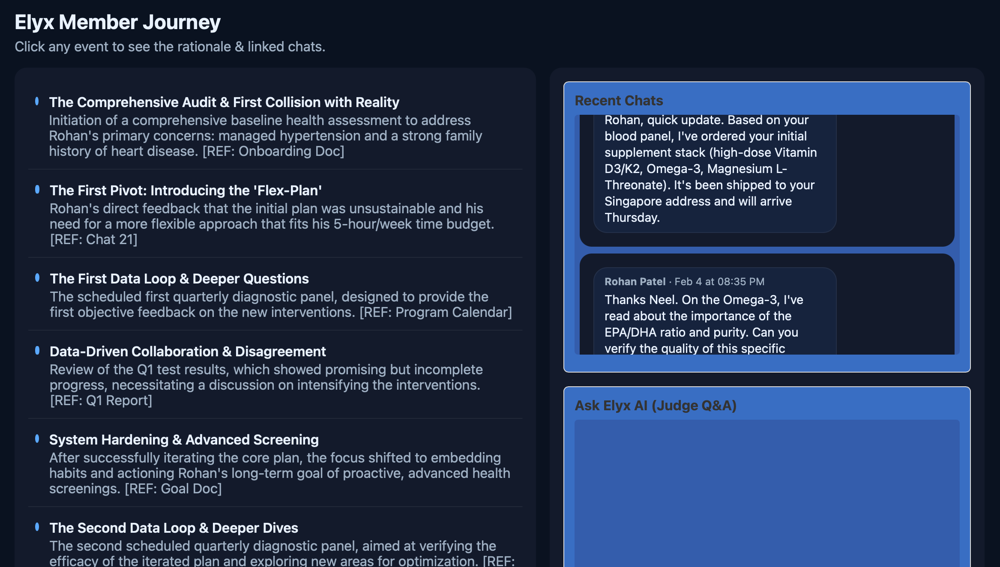
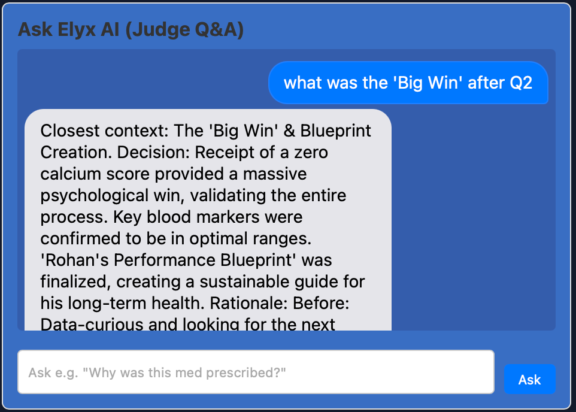

# Elyx Hackathon - Team AguaDrinkers

This repository contains our hackathon project submission.  
The app visualizes the patient journey timeline, chat logs, and includes an interactive Chat feature where one can query rationale for medical decisions.

---

## Project Structure
```
elyx_hackathon_team_AguaDrinkers/
│
├── data/                  # JSON data files
│   ├── chats.json
│   └── journey.json
│
├── src/                   # React source files
│   ├── app.jsx
│   ├── main.jsx
│   ├── styles.css
│   └── components/        # UI Components
│       ├── ChatViewer.jsx
│       ├── EventTimeline.jsx
│       ├── JudgeChat.jsx
│       └── RationaleModal.jsx
│
├─ prompts/
│   └──generate_convo.ipynb
│
├── package.json
└── README.md
```
---

## Installation & Setup

### 1. Clone the repository
```bash
git clone https://github.com/<your-username>/<repo-name>.git
cd <repo-name>
```
### 2. Install Dependencies
```bash
npm install
```

### 3. Run the development server
```bash
npm run dev
```

After running, open:
```
http://localhost:5173/
```


## Demo Screenshots

### 🗂️ Journey Timeline


### 🗂️ Deep Dive window


### 💬 Chat

